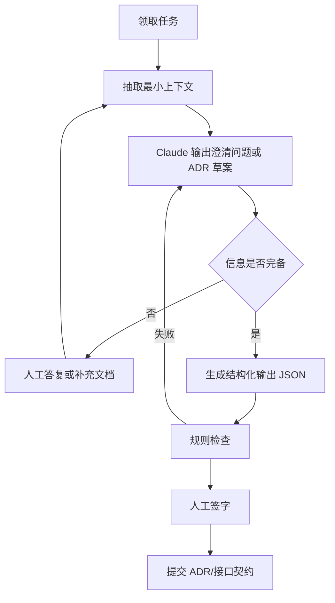
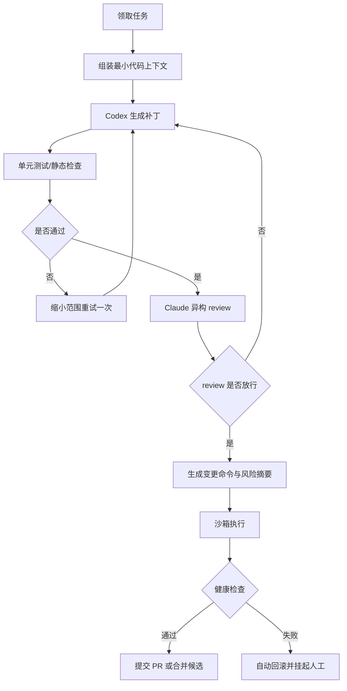
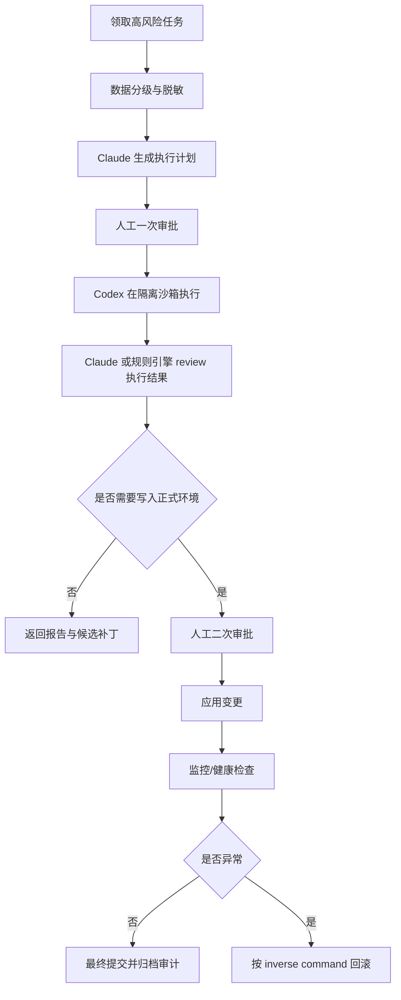
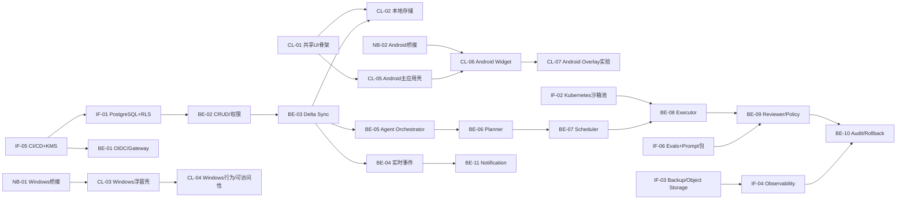
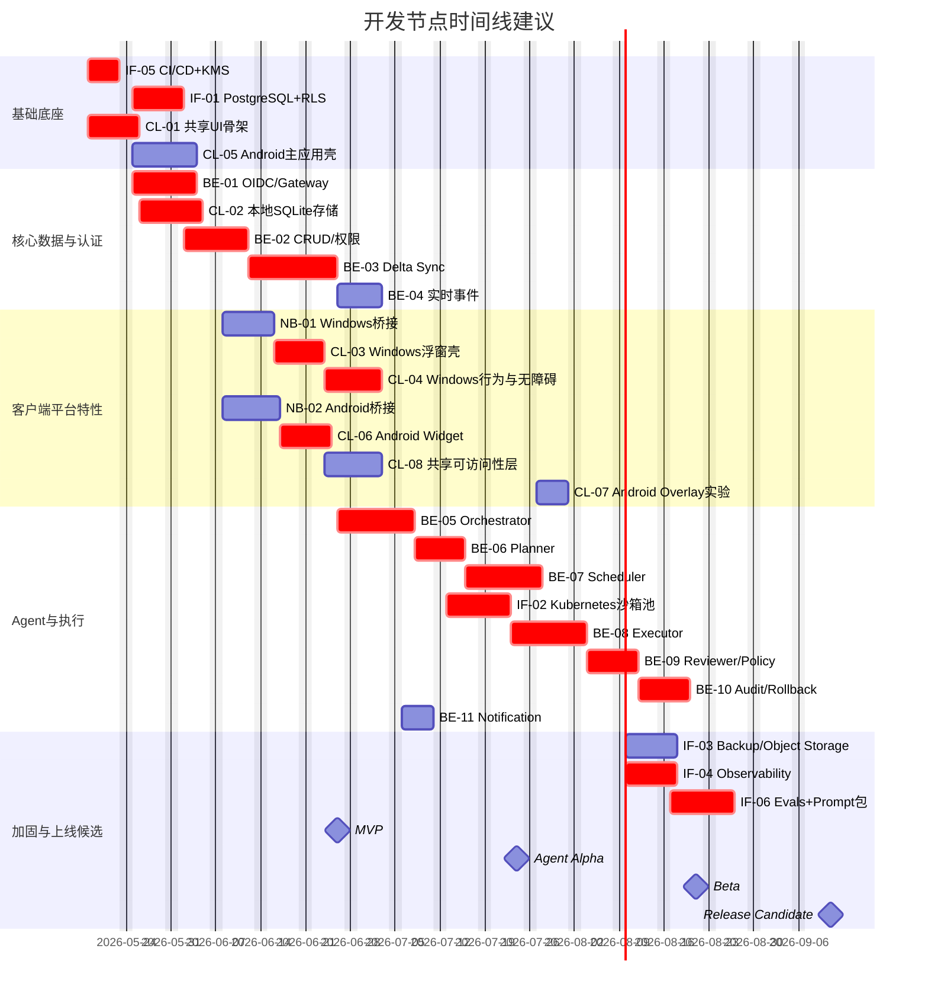

# 面向Claude与Codex分派的Agent辅助Todo开发节点图研究

## 执行摘要

本报告是在前一次方案研究的技术边界之上，进一步把“要做什么”细化为“谁来做、按什么顺序做、失败后如何回退、何时需要人工审批”的开发节点图。产品基线仍以 TickTick 官方公开能力为参照，包括任务、日历、时间线、Widgets、桌面 Sticky Notes、协作、Summary 与 MCP 相关能力；实现边界仍限定为 Windows 与 Android，并沿用“Tauri 2 作为共享主应用壳，Windows 通过 Tauri + Win32 扩展样式实现半透明常驻浮窗，Android 以 App Widget/Glance 为主、Overlay 为可选实验能力”的路线。Tauri 官方文档确认其窗口自定义能力覆盖透明窗口等场景；Microsoft Win32 文档确认 `WS_EX_TOPMOST`、`WS_EX_LAYERED`、`WS_EX_TOOLWINDOW`、`WS_EX_NOACTIVATE` 等扩展样式的行为；Android 官方文档则明确 Glance/App Widget 是 widget 正道，而 `TYPE_APPLICATION_OVERLAY` 需要 `SYSTEM_ALERT_WINDOW`，且系统可主动调整其位置、大小与可见性。citeturn8search17turn8search1turn8search0turn8search2turn8search10turn8search14turn9search7turn12view0turn12view1turn10view0turn0search2turn11view0turn11view2turn11view3

任务分派结论是：**Claude 负责规格化、拆解、评审、提示词与策略类工作；Codex 负责代码实现、重构、单元测试、迁移脚本与可重复工程任务；认证、数据出境、沙箱白名单、生产部署、Android Overlay 权限与高风险写操作必须进入人工或混合审批轨道。** 这样分配并非抽象偏好，而是贴合官方产品定位：Codex 官方将自身定位为“软件开发 coding agent”，强调理解代码库、生成代码、review、debug、refactor、migration 与自动化开发任务；Claude 官方文档则把提示词工程、XML 结构化、工具使用、并行工具调用和 agentic loop 作为核心工作面。同时，OpenAI 与 Anthropic 都提供了面向工具/上下文工程的机制；尤其 Claude 的工具搜索文档直接指出，在多工具场景下按需加载可把工具定义上下文缩减 85% 以上，且只加载 3–5 个相关工具。citeturn14view1turn15view3turn5search11turn5search0turn13view3turn13view0turn13view4

从关键路径看，真正的瓶颈不是界面开发，而是**基础权限与数据底座 → 同步协议 → 本地优先存储 → Agent 编排状态机 → 调度求解器 → Executor 沙箱 → Reviewer/审计/回滚**。这条路径对应的底层依据也较明确：OIDC 是构建在 OAuth 2.0 之上的身份层；PostgreSQL RLS 适合做多租户/多用户级别的行级访问控制；SQLite WAL 在本地优先应用里更适合并发读写；OR-Tools 的 CP-SAT 官方明确覆盖员工排班/约束调度场景；Kubernetes Job 官方适合一次性、可重试、跑完即止的隔离执行任务。也因此，建议将本项目切分为 5 个里程碑：**底座、MVP、Agent Alpha、Executor/Reviewer Beta、上线候选**，并让 Claude/Codex 在每个里程碑内沿“计划—实现—异构review—审批—沙箱执行—回滚”的闭环协作。citeturn16view0turn16view1turn16view2turn17view1turn16view3

## 任务清单与模块分派

下面的任务分解，建立在此前建议的模块边界之上：客户端采用共享 UI/业务层；平台差异通过 Windows 与 Android 原生桥接补齐；后端拆为 API/Gateway、Sync、Agent Orchestrator、Scheduler、Executor、Reviewer；基础设施覆盖数据库、备份、监控、CI/CD、沙箱与审计。之所以单列 Windows 浮窗、Android Widget 与 Android Overlay，是因为这三者的官方平台能力和权限边界并不相同：Windows 浮窗依赖顶层窗口与 Win32 样式；Android Widget 需遵守 App Widget/Glance 的低功耗更新约束；Overlay 需要 `TYPE_APPLICATION_OVERLAY`/`SYSTEM_ALERT_WINDOW`，且 Android 官方明确系统可能随时调整其窗口状态。citeturn12view3turn10view0turn11view0turn11view2turn11view3

下表中的工时均为**粗略团队工程小时**，不是个人自然日；风险等级分为低、中、高；未指定的外部系统、发布渠道、法务边界均标记为“未指定”。

**客户端与原生桥接任务表**

| ID | 模块 | 子任务 | 目标 | 输入 | 输出 | 验收标准 | 估时 | 优先级 | 风险 | 首选执行者 | 分配理由 |
|---|---|---|---|---|---|---|---:|---|---|---|---|
| CL-01 | 共享 UI/业务层 | 共享 UI 骨架与路由 | 建立 Windows/Android 共用页面壳与导航 | PRD、信息架构、设计令牌 | `app-shell`、路由、主题、状态容器 | 能运行登录、Today、Inbox、Calendar、Settings 五个主路由；Windows/Android 编译通过 | 24h | P0 | 低 | 混合 | Claude 先产出界面 contract，Codex 落地组件和路由 |
| CL-02 | 共享 UI/业务层 | 领域模型与本地 SQLite 存储 | 建本地优先数据层 | DTO 草案、同步规则、字段字典 | 类型定义、迁移脚本、Repository、缓存层 | 离线增删改查通过；迁移可回滚；本地查询延迟可接受 | 32h | P0 | 中 | Codex | 代码密集，验收清晰，适合自动生成+测试 |
| CL-03 | Windows 浮窗 | Windows 浮窗基础壳 | 做独立小组件窗口 | 设计稿、窗口规格、桥接 API | 浮窗窗口、显示/隐藏/位置持久化 | 支持透明、始终置顶、无边框、记忆位置、快速唤起 | 24h | P0 | 中 | Codex | 以工程实现为主 |
| CL-04 | Windows 浮窗 | 浮窗行为、热键与可访问性 | 做 glance/interact 双模式 | CL-03、无障碍规范、热键列表 | 模式切换、热键、键盘导航、读屏语义 | 可切换瞥视/交互模式；Tab 可达；Narrator 可读；热键冲突有降级 | 28h | P0 | 高 | 混合 | 交互策略需 Claude 推敲，代码与修复由 Codex 实现 |
| CL-05 | Android 主应用 | Android 主应用壳 | 建 Android 端应用骨架 | CL-01 产物、Android 设计适配 | Activity/导航/登录态承接 | 主流程可运行，支持冷启动、前后台恢复、深链接基础 | 24h | P0 | 低 | Codex | 结构化实现多 |
| CL-06 | Android Widget | Home Screen Widget | 做今日任务/日程 widget | Widget 规格、数据查询 API、桥接层 | Glance/Widget Provider、点击跳转、刷新策略 | 可展示今日关键项；点击跳主应用；部分更新可用；重启后恢复 | 24h | P0 | 中 | Codex | Glance 与 WorkManager 代码较直接 |
| CL-07 | Android Overlay | Overlay 实验能力 | 实现可选悬浮窗 | 权限策略、法务结论、桥接 API | Overlay Service、拖拽/折叠、权限流程 | 功能隐藏在 feature flag 后；默认关闭；授权流程清晰；失权可降级 | 20h | P2 | 高 | 人工/混合 | 高权限、兼容性和合规风险高 |
| CL-08 | 共享 UX | 快捷输入与可访问性统一层 | 统一任务快速采集与焦点/语义策略 | 输入场景、字段模板、可访问性清单 | 快捷输入组件、表单语义、错误提示规范 | 支持键盘/触控；错误提示可读；颜色不是唯一语义 | 20h | P1 | 中 | Claude | 更偏规格与交互一致性 |
| NB-01 | Windows 原生桥接 | Win32 窗口桥接插件 | 暴露 Window style/opacity/hotkey 能力 | Tauri 壳、Win32 API 列表 | Rust 插件、桥接命令、错误码 | 可切换 topmost/layered/toolwindow；异常可回退 | 24h | P0 | 高 | Codex | 边界明确，偏系统代码 |
| NB-02 | Android 原生桥接 | Widget/Overlay/WorkManager 桥接 | 承接 Android 原生能力 | Kotlin 模块规范、CL-06/07 需求 | Kotlin bridge、广播接收器、Worker | Widget/Overlay 调用链闭合；桥接 API 稳定 | 28h | P0 | 中 | Codex | 原生实现密度高，适合代码代理 |

**后端任务表**

| ID | 模块 | 子任务 | 目标 | 输入 | 输出 | 验收标准 | 估时 | 优先级 | 风险 | 首选执行者 | 分配理由 |
|---|---|---|---|---|---|---|---:|---|---|---|---|
| BE-01 | API/Gateway | OIDC 认证与网关 | 建统一入口、身份与会话边界 | 身份策略、租户模型、客户端需求 | OIDC 对接、token 校验、中间件、API 网关 | 登录/刷新/登出闭环；租户隔离正确；审计可追踪 | 32h | P0 | 高 | 人工/混合 | 涉及认证与安全，不宜纯模型自动写入 |
| BE-02 | Core API | 任务/日程 CRUD 与权限 | 建核心业务 API | 数据模型、RLS 方案、客户端 contract | REST/GraphQL 或 RPC 接口、权限校验 | 任务/日程/共享权限主流程通过；越权测试不过 | 40h | P0 | 中 | Codex | 接口型业务代码多，测试明确 |
| BE-03 | Sync Service | 增量同步与冲突合并 | 建多端同步主链路 | DTO、版本字段、离线合并规则 | delta pull/push、merge、冲突对象 | 断网修改后可合并；冲突可见；幂等重放通过 | 48h | P0 | 高 | 混合 | 算法/语义复杂，需 Claude 先定 merge 规则 |
| BE-04 | Sync Service | WebSocket/实时事件 | 推送协作与同步提示 | BE-03 事件模型 | 事件总线、订阅 API、断线恢复 | 在线变更秒级到达；断线重连后补齐 | 24h | P1 | 中 | Codex | 工程实现明确 |
| BE-05 | Agent Orchestrator | Agent 状态机与编排 | 建“提案—审批—执行—回滚”总控 | 任务状态图、审批规则、执行器列表 | Agent Run、状态机、重试与人工接管接口 | 能按状态推进；失败可重试/挂起/终止 | 40h | P0 | 高 | Claude | 偏流程设计与边界定义 |
| BE-06 | Planner | 任务拆解与澄清问答 | 把目标拆成结构化子任务 | 用户意图、项目上下文、模板 | 拆解 JSON、问题列表、计划草案 | 相同输入稳定输出结构；缺信息时能发问而不乱猜 | 32h | P1 | 高 | Claude | 语言理解和结构化规划更强相关 |
| BE-07 | Scheduler | 自动排期与冲突求解 | 输出可行日程或冲突说明 | 任务 DAG、工作时间、多人可用性 | 求解器模型、计划结果、解释层 | 在样例数据集上给出可行解或不可行原因 | 40h | P1 | 高 | 混合 | 约束建模靠 Claude，求解器实现靠 Codex |
| BE-08 | Executor | 工具注册表与安全执行 | 调度 Claude/Codex/外部工具 | 工具清单、审批规则、沙箱能力 | Tool Registry、执行任务单、命令预览 | 只在 allowlist 内执行；高风险动作进入审批 | 40h | P1 | 高 | 人工/混合 | 涉及外部调用与执行边界 |
| BE-09 | Reviewer | 异构 review 与策略引擎 | 做自动 review、策略比对 | patch、日志、风险规则 | reviewer pipeline、policy verdict | 主执行模型和 reviewer 异构；能输出阻断理由 | 32h | P1 | 高 | Claude | 更适合解释、归纳与风险提示 |
| BE-10 | Audit | 审计与回滚 | 记录命令、逆操作与审批链 | 变更命令、actor、对象历史 | 审计日志、inverse command、回滚 API | 任一高风险写操作都可追溯；可回滚到前一状态 | 32h | P0 | 高 | Codex | 事务和日志实现为主 |
| BE-11 | Notification | 提醒与回执 | 通知任务、审批、失败回退 | 事件源、用户偏好、渠道配置 | push/邮件站内信策略 | 能对关键审批和失败及时通知；可静音配置 | 20h | P1 | 中 | Codex | 标准工程任务 |

**基础设施与质量任务表**

| ID | 模块 | 子任务 | 目标 | 输入 | 输出 | 验收标准 | 估时 | 优先级 | 风险 | 首选执行者 | 分配理由 |
|---|---|---|---|---|---|---|---:|---|---|---|---|
| IF-01 | DB | PostgreSQL schema 与 RLS | 建权威事务库和租户隔离 | 数据模型、权限表、审计需求 | DDL、策略、迁移 | 租户/成员隔离正确；迁移可回滚；审计字段齐全 | 32h | P0 | 高 | 人工/混合 | 涉及数据边界与权限 |
| IF-02 | Sandbox | Kubernetes Job 沙箱池 | 建一次性隔离执行池 | 镜像、权限模型、网络策略 | Job 模板、镜像、配额、清理逻辑 | 任务可独立执行、可重试、可清理、默认无外网 | 40h | P1 | 高 | 人工/混合 | 生产风险高 |
| IF-03 | Backup | 备份、附件与对象存储 | 建数据与附件保护链路 | DB、对象存储、扫描策略 | PITR/快照、对象策略、清理脚本 | 可恢复演练通过；附件有基础扫描与保留策略 | 24h | P1 | 高 | 人工/混合 | 涉及恢复与安全 |
| IF-04 | Observability | 监控、日志、SLO | 建可观测性与审计看板 | 服务列表、关键指标 | tracing、metrics、日志汇聚、告警 | 能定位同步失败、执行失败、求解超时 | 24h | P0 | 中 | Codex | 规则明确、重复性高 |
| IF-05 | Delivery | CI/CD、预览环境、密钥/KMS | 建交付流水线与机密治理 | 仓库结构、部署环境、密钥策略 | pipeline、preview env、secret 注入 | PR 可起预览；机密不落盘；审批链可配置 | 28h | P0 | 高 | 人工/混合 | 触及供应链与凭证 |
| IF-06 | Quality | 评测集、prompt 包、runbook | 固化回归与运维文档 | 样例任务、失败用例、流程规范 | eval 数据集、技能包、SOP 文档 | 关键场景可回归；运维和回滚手册可执行 | 24h | P1 | 中 | 混合 | 文档与评测更适合 Claude 起草，Codex 补脚本 |

上述任务拆分中，Windows 浮窗之所以拆成“窗口壳”和“行为/可访问性”两项，是因为 `WS_EX_NOACTIVATE` 这类样式虽然适合瞥视态窗口，但 Microsoft 文档明确指出，这种窗口不应通过编程访问或通过辅助技术键盘导航激活，因此不能把无障碍交互与窗口层行为揉成一个任务；Android Widget 与 Overlay 也必须分开，因为官方把 Widget 视为嵌入式、周期更新、低功耗视图，而 Overlay 是系统窗口能力，权限和系统干预机制完全不同。citeturn10view0turn11view0turn11view2turn11view3

## 模型分配策略与提示模板

在能力匹配上，不建议简单理解成“Claude 负责写文档，Codex 负责写代码”。更准确的做法是把整个研发链条拆成四类：**规格化与问题澄清、确定性工程实现、异构审查与策略判断、高风险人工把关**。Claude 官方文档把提示词工程、XML 结构化、工具使用、工具描述质量、并行工具调用与 agentic 系统作为关键成功因素；Codex 官方文档则强调自己能理解既有代码结构、生成匹配项目约定的代码、review、debug、refactor、migration，并在沙箱与审批流内运行。因此，把 Claude 放在“计划、归纳、澄清、规则判断、review 解释”一侧，把 Codex 放在“实现、修复、测试、迁移、脚本”一侧，是更符合官方能力边界的分工。citeturn5search8turn5search11turn13view2turn13view3turn14view1turn15view3turn14view0

同时，最小上下文是强约束，不是优化项。Claude 的工具搜索文档明确指出，多工具场景若把全部工具定义直接塞进上下文，典型多服务器设置会先消耗约 55k token；按需工具搜索通常能把这部分缩减 85% 以上，只暴露 3–5 个相关工具。OpenAI 的工具文档也明确支持工具搜索，在交互中按需延迟加载函数定义。因此，无论是给 Claude 还是 Codex，都应尽量只发送任务卡、相关接口、文件清单、失败测试和少量邻近代码，而不是整个仓库。citeturn13view0turn13view1turn13view4

**能力匹配矩阵**

| 工作类型 | 首选执行者 | 次选/Reviewer | 适配原因 | 最小上下文包 |
|---|---|---|---|---|
| 需求澄清、ADR、接口契约、策略草案 | Claude | 人工 / Codex | 自然语言理解、歧义消解、结构化输出更强 | 任务卡、边界条件、已有 ADR、相关 API 摘要 |
| 提示词模板、工具描述、评测集样例 | Claude | 人工 | Claude 官方对 XML/工具描述/agentic 系统指导更细 | 成功标准、失败样例、工具 schema |
| 页面骨架、CRUD、桥接层、单元测试、迁移脚本 | Codex | Claude | Codex 官方将其直接定位为 coding agent | 任务卡、目标文件、测试命令、禁止改动区 |
| Bug 修复、回归修补、日志追因 | Codex | Claude | 适合围绕 failing tests 和日志做 targeted fix | 错误日志、相关文件、复现步骤、测试命令 |
| 调度求解器、同步冲突语义、状态机 | 混合 | 人工 | 先由 Claude 固定语义，再由 Codex 实现和测试 | 数学约束、状态转移图、样例数据集 |
| 认证、KMS、数据出境、沙箱白名单、生产发布 | 人工/混合 | Claude + Codex | 需要双重解释与严格审批 | 最小策略片段、变更草案、风险说明，不直接给生产密钥 |

**上下文最小化策略**

| 上下文块 | 必带内容 | 严禁默认发送 |
|---|---|---|
| 任务卡 | 任务 ID、目标、验收标准、风险等级、依赖 | 完整 PRD、无关 backlog |
| 代码上下文 | 目标文件、相邻接口、调用链、失败测试 | 整仓库源码、全部 `.env` |
| 数据上下文 | 字段字典、脱敏样例、schema 片段 | 真实用户数据、未经脱敏的日志 |
| 工具上下文 | 当前任务所需 3–5 个工具定义 | 全部工具目录、全部平台凭据 |
| 运行上下文 | 分支名、基线 commit、允许命令列表 | 生产数据库连接串、广域写权限 |
| 审批上下文 | 风险说明、拟执行命令、回滚方案 | 非当前任务相关审批历史 |

**Claude 提示模板骨架**

```xml
<role>
你是系统设计与任务拆解代理，只能基于给定上下文输出，不得猜测“未指定”部分。
</role>

<task_card>
id: BE-07
goal: 为多人任务/日程生成可行排期
priority: P1
risk: high
</task_card>

<context>
  <business_rules>
    工作时段、依赖、截止时间、多人可用性、禁止重叠、缓冲时间
  </business_rules>
  <contracts>
    只读文件: docs/scheduler-spec.md
    相关接口: packages/shared/src/domain/schedule.ts
  </contracts>
  <examples>
    给出 2 个可行样例、1 个不可行样例
  </examples>
</context>

<success_criteria>
输出 JSON:
{
  "open_questions": [],
  "constraint_model": [],
  "objective_terms": [],
  "edge_cases": [],
  "test_cases": []
}
</success_criteria>

<do_not>
不要生成代码；不要修改未列出的文件；若信息不足，先列问题。
</do_not>
```

**Codex 提示模板骨架**

```text
Task: Implement CL-06 Android widget
Repository scope:
- apps/android/*
- packages/shared/src/*
Allowed files:
- apps/android/widget/**
- apps/android/bridge/**
Read-only references:
- docs/widget-spec.md
- packages/shared/src/domain/widget.ts

Acceptance:
1) Show next 4 agenda items
2) Tap item opens app detail page
3) Partial update supported
4) Reboot recovery works
5) Tests and lint pass

Run:
./gradlew test
./gradlew lint

Return exactly:
- changed_files
- commands_run
- test_results
- residual_risks

Do not:
- modify auth modules
- add new permissions
- touch CI/CD or secrets
```

上面的模板骨架有两个关键点。其一，Claude 侧输出必须更偏**计划、约束、问题与测试样例**，而不是直接跨越到写代码；其二，Codex 侧必须强制给出**文件范围、禁改范围、测试命令、返回格式**。这样做既贴合 Claude 官方的 prompt/tool 设计建议，也贴合 Codex 的项目配置、审批与沙箱边界机制。citeturn13view2turn5search11turn14view0turn15view3

## 多轮交互与审批流

多轮交互不应该是“把任务丢给模型，然后等结果”。更稳妥的方式是统一成**领取 → 上下文准备 → 执行 → 异构 review → 变更命令 → 审批 → 沙箱执行 → 提交/回滚**。Claude 官方的工具使用文档明确提示，多工具场景下可能在单轮返回多个 `tool_use` 块；你的循环必须逐个处理，而不是只读第一个。OpenAI 的工具文档也强调工具调用、函数调用和按需加载能力应放在工作流设计里，而不是单次问答里。citeturn13view3turn13view4

**设计/规格类任务标准流**



**代码实现类任务标准流**



**高风险执行/部署类任务标准流**



**默认超时、重试与失败回退**

| 阶段 | 默认超时 | 重试 | 回退策略 |
|---|---:|---:|---|
| 任务领取 | 10 分钟 | 0 | 超时则退回队列 |
| 上下文准备 | 5 分钟 | 1 次 | 若上下文超限，自动裁剪到任务卡+文件清单+失败测试 |
| Claude 规划/澄清 | 15 分钟 | 1 次 | 仍不收敛则改为人工澄清 |
| Codex 实现 | 30 分钟 | 1 次 | 第二次失败则自动切小子任务或转“诊断模式” |
| 自动 review | 10 分钟 | 1 次 | 换异构 reviewer 或仅保留规则引擎 |
| 沙箱执行 | 20 分钟 | 2 次 | 每次使用全新环境；两次失败则冻结任务 |
| 人工审批 | 24 小时 | 0 | 过期自动失效，不自动执行 |
| 发布后健康检查 | 15 分钟 | 1 次 | 失败则自动回滚一次并通知人工 |

这里最关键的不是“有没有重试”，而是**重试必须是可解释和幂等的**。执行类任务应始终带上 `task_id + spec_hash + repo_head + attempt` 作为幂等键；任何需要写入的动作都必须先生成**变更命令预览**和**inverse command**，再进入审批与执行。这样才能和后面的审计/回滚机制闭合。这个要求与 Codex 沙箱/审批边界、Claude 工具循环和多工具返回格式是吻合的。citeturn15view3turn13view3

## 开发节点图与任务时间线

节点图的关键，不是把全部任务平铺，而是把**依赖、并行度和关键路径**显示出来。就本项目而言，关键路径主要是：**IF-05 → IF-01 → BE-01/BE-02 → BE-03 → CL-02 → BE-05 → BE-07 → IF-02 → BE-08 → BE-09 → BE-10**。这是因为客户端能否真正“多端同步 + Agent 可执行”，最终取决于权威数据库、权限、同步协议、调度器与沙箱执行是否先稳定下来，而不只是 UI 能否先跑起来。PostgreSQL RLS、SQLite WAL、OR-Tools CP-SAT 与 Kubernetes Job，分别支撑了权限边界、本地优先、排期求解与一次性隔离执行这四个关键节点。citeturn16view1turn16view2turn17view1turn16view3

**任务依赖节点图**



**甘特图时间线**



**可导出任务清单表**

| 任务ID | 名称 | 模块 | 负责人 | 估时 | 建议开始 | 建议结束 | 依赖ID |
|---|---|---|---|---:|---|---|---|
| IF-05 | CI/CD+KMS | Delivery | 人工/混合 | 28h | 2026-05-18 | 2026-05-22 | - |
| CL-01 | 共享UI骨架 | Client | 混合 | 24h | 2026-05-18 | 2026-05-25 | - |
| IF-01 | PostgreSQL+RLS | DB | 人工/混合 | 32h | 2026-05-25 | 2026-05-30 | IF-05 |
| CL-05 | Android主应用壳 | Client | Codex | 24h | 2026-05-25 | 2026-06-03 | CL-01 |
| BE-01 | OIDC/Gateway | API | 人工/混合 | 32h | 2026-05-25 | 2026-06-04 | IF-05 |
| CL-02 | 本地SQLite存储 | Client | Codex | 32h | 2026-05-26 | 2026-06-06 | CL-01 |
| NB-01 | Windows桥接 | Native | Codex | 24h | 2026-06-08 | 2026-06-13 | CL-01 |
| NB-02 | Android桥接 | Native | Codex | 28h | 2026-06-08 | 2026-06-16 | CL-05 |
| BE-02 | CRUD/权限 | API | Codex | 40h | 2026-06-02 | 2026-06-12 | IF-01,BE-01 |
| CL-03 | Windows浮窗壳 | Client | Codex | 24h | 2026-06-15 | 2026-06-22 | NB-01,CL-02 |
| CL-06 | Android Widget | Client | Codex | 24h | 2026-06-17 | 2026-06-24 | NB-02,CL-05,CL-02 |
| BE-03 | Delta Sync | Sync | 混合 | 48h | 2026-06-15 | 2026-06-26 | BE-02 |
| CL-04 | Windows行为/无障碍 | Client | 混合 | 28h | 2026-06-23 | 2026-07-02 | CL-03 |
| CL-08 | 快捷输入/无障碍统一层 | Client | Claude | 20h | 2026-06-24 | 2026-07-03 | CL-01 |
| BE-04 | 实时事件 | Sync | Codex | 24h | 2026-06-29 | 2026-07-03 | BE-03 |
| BE-05 | Orchestrator | Agent | Claude | 40h | 2026-06-29 | 2026-07-10 | BE-03 |
| BE-11 | Notification | Backend | Codex | 20h | 2026-07-06 | 2026-07-10 | BE-04 |
| IF-02 | Kubernetes沙箱池 | Sandbox | 人工/混合 | 40h | 2026-07-13 | 2026-07-24 | IF-05 |
| BE-06 | Planner | Agent | Claude | 32h | 2026-07-13 | 2026-07-18 | BE-05 |
| BE-07 | Scheduler | Agent | 混合 | 40h | 2026-07-20 | 2026-07-31 | BE-06 |
| CL-07 | Android Overlay实验 | Client | 人工/混合 | 20h | 2026-07-27 | 2026-07-31 | CL-06,NB-02 |
| BE-08 | Executor | Agent | 人工/混合 | 40h | 2026-07-27 | 2026-08-07 | IF-02,BE-07 |
| IF-03 | Backup/Object Storage | Infra | 人工/混合 | 24h | 2026-08-10 | 2026-08-17 | IF-01 |
| IF-04 | Observability | Infra | Codex | 24h | 2026-08-10 | 2026-08-17 | BE-03 |
| BE-09 | Reviewer/Policy | Agent | Claude | 32h | 2026-08-10 | 2026-08-17 | BE-08 |
| BE-10 | Audit/Rollback | Agent | Codex | 32h | 2026-08-18 | 2026-08-25 | BE-09,IF-04 |
| IF-06 | Evals+Prompt包 | Quality | 混合 | 24h | 2026-08-17 | 2026-08-28 | BE-09,BE-10 |

**CSV 示例片段**

```csv
task_id,name,module,owner,estimate_hours,start_date,end_date,depends_on
IF-05,CI/CD+KMS,Delivery,Human+Mixed,28,2026-05-18,2026-05-22,
CL-01,共享UI骨架,Client,Mixed,24,2026-05-18,2026-05-25,
IF-01,PostgreSQL+RLS,DB,Human+Mixed,32,2026-05-25,2026-05-30,IF-05
BE-01,OIDC/Gateway,API,Human+Mixed,32,2026-05-25,2026-06-04,IF-05
CL-02,本地SQLite存储,Client,Codex,32,2026-05-26,2026-06-06,CL-01
BE-02,CRUD/权限,API,Codex,40,2026-06-02,2026-06-12,"IF-01;BE-01"
NB-01,Windows桥接,Native,Codex,24,2026-06-08,2026-06-13,CL-01
NB-02,Android桥接,Native,Codex,28,2026-06-08,2026-06-16,CL-05
CL-03,Windows浮窗壳,Client,Codex,24,2026-06-15,2026-06-22,"NB-01;CL-02"
BE-03,Delta Sync,Sync,Mixed,48,2026-06-15,2026-06-26,BE-02
```

## 运行时调度策略

运行时调度的核心不是“谁先空闲就给谁”，而是**按任务类型、风险等级、上下文预算、并发冲突与日成本预算联合决策**。这里推荐做四层策略：第一层按**任务标签**筛 executor；第二层按**风险等级**判断是否直接阻断到人工；第三层按**上下文大小与成本预算**做瘦身或降级；第四层按**仓库写入冲突**限制同一代码域同时只跑一个写任务。OpenAI 的工具文档说明可以在交互中按需加载 tool definitions；Codex 的配置文档说明可通过项目配置、审批策略、沙箱模式与可信项目控制执行边界；Claude 的工具搜索文档则进一步说明大工具面应该使用按需发现而不是全量注入。citeturn13view4turn14view0turn13view0

推荐的默认并发与限流如下：

| 队列 | 默认执行者 | 并发上限 | 说明 |
|---|---|---:|---|
| `plan` | Claude | 2 | 规格、ADR、拆解、review 解释 |
| `code` | Codex | 4 | 一般代码实现、修复、测试 |
| `mixed` | Claude→Codex | 2 | 先规划后实现的交叉任务 |
| `review` | 异构模型 | 2 | 主模型不得 self-approve |
| `human_gate` | 人工 | 不限 | 但所有高风险写入必须阻塞等待 |

成本控制上建议遵循“三步法”：  
先裁剪上下文；  
再降低低优先级任务并发；  
最后才考虑模型降级。  

其中“降级”不建议直接把高风险任务换成更便宜模型，而应该只对**低风险、只读、模板化**任务生效。高风险写任务的第一选择不是“便宜模型”，而是“更严格审批”。OpenAI 与 Anthropic 官方都提供了工具/提示/上下文优化路径，因此先做上下文瘦身，往往比盲目换模型更稳妥。citeturn13view4turn13view0turn5search8

**调度算法示例伪代码**

```typescript
type Risk = "low" | "medium" | "high";
type Kind = "spec" | "code" | "mixed" | "security" | "deploy";
type Executor = "claude" | "codex" | "human" | "mixed";

interface Task {
  id: string;
  kind: Kind;
  risk: Risk;
  priority: "P0" | "P1" | "P2";
  repoScope: string[];
  contextBytes: number;
  dependsOn: string[];
  preferredExecutor: Executor;
}

interface BudgetState {
  dailyUsdUsed: number;
  dailyUsdLimit: number;
  claudeSlots: number;
  codexSlots: number;
  mixedSlots: number;
}

function classifyExecutor(task: Task): Executor {
  if (task.kind === "security" || task.kind === "deploy") return "human";
  if (task.risk === "high" && task.kind !== "spec") return "mixed";
  if (task.kind === "spec") return "claude";
  if (task.kind === "code") return "codex";
  return task.preferredExecutor;
}

function shrinkContext(task: Task) {
  return {
    taskCard: true,
    relatedFilesOnly: 8,
    includeFailingTestsOnly: true,
    redactSecrets: true,
    toolLimit: 5,
  };
}

function canRunWriteTask(task: Task, running: Task[]): boolean {
  const writeKinds = new Set(["code", "mixed", "deploy", "security"]);
  if (!writeKinds.has(task.kind)) return true;
  return !running.some(t =>
    writeKinds.has(t.kind) &&
    t.repoScope.some(p => task.repoScope.includes(p))
  );
}

function chooseQueue(task: Task, budget: BudgetState): Executor | null {
  const exec = classifyExecutor(task);

  // High-risk tasks must wait for human gate before execution
  if (task.risk === "high" && exec !== "human" && exec !== "mixed") return "mixed";

  // Cost control: once 80% budget is used, postpone P2 and reduce mixed traffic
  const ratio = budget.dailyUsdUsed / budget.dailyUsdLimit;
  if (ratio > 0.8 && task.priority === "P2") return null;

  if (exec === "claude" && budget.claudeSlots > 0) return "claude";
  if (exec === "codex" && budget.codexSlots > 0) return "codex";
  if (exec === "mixed" && budget.mixedSlots > 0) return "mixed";
  if (exec === "human") return "human";

  return null;
}

function dispatch(task: Task, running: Task[], budget: BudgetState) {
  if (!canRunWriteTask(task, running)) return { status: "blocked_conflict" };

  const queue = chooseQueue(task, budget);
  if (!queue) return { status: "deferred_budget_or_capacity" };

  const contextPack = shrinkContext(task);
  const idempotencyKey = `${task.id}:${hash(task.repoScope.join(","))}:${Date.now()}`;

  return {
    status: "queued",
    queue,
    contextPack,
    idempotencyKey,
    timeoutMs: queue === "codex" ? 30 * 60_000 : 15 * 60_000,
    retryPolicy: {
      maxRetries: queue === "human" ? 0 : 1,
      backoff: "exponential",
      onSecondFailure: task.kind === "code" ? "split_task" : "escalate_human"
    }
  };
}
```

这段伪代码体现了四个工程上必须落地的点：一是**高风险任务永远不自动直通**；二是**同一 repo scope 的写任务串行化**，避免两个模型同时改同一片代码；三是**上下文包固定收敛**；四是**幂等键与二次失败升级机制**。在真正实现里，还应补上基于 repo branch、task version 和 approval token 的幂等保护。Codex 官方文档对 sandbox/approval/config/trusted project 的支持，正适合作为这套调度器的执行后端之一。citeturn14view0turn15view3

## 安全控制点与阶段验收

安全与合规控制点不应该只存在于“部署上线前”，而应嵌入模型调用、上下文组装、工具执行、日志保留、数据出境与生产写入各个阶段。OpenAI 官方数据控制文档说明：API 输入输出默认不用于训练，除非显示 opt in；同时滥用监控日志默认可保留最多 30 天。Anthropic 官方数据保留文档说明：Claude API 可提供 ZDR，但并非所有功能都在 ZDR 范围内；其 MCP connector 文档明确注明该功能**不属于 ZDR**。Codex 官方沙箱文档则把“受限环境 + 审批流”定义为 agent 自主性边界。结合 OIDC 与 PostgreSQL RLS 的授权/数据访问模型，可以得出一个明确结论：**模型调用与代码执行必须分层分级，不应让任何单个模型或工具同时持有“全部上下文 + 全部权限 + 直接生产写入”三件套。** citeturn15view0turn15view1turn15view2turn15view3turn16view0turn16view1

**必须落地的安全检查点**

| 控制点 | 检查项 | 审批门槛 | 默认动作 |
|---|---|---|---|
| 模型输入前 | PII/密钥/附件/代码片段脱敏；仅发送最小字段 | 涉及敏感/受限数据时人工批准 | 未批准则只发摘要或拒绝发送 |
| 工具选择前 | 仅暴露当前任务需要的 3–5 个工具 | 工具面 > 5 个需工具搜索或人工裁剪 | 自动裁剪工具上下文 |
| 外部模型路由 | 检查是否进入非 ZDR 功能或第三方链路 | 涉及非 ZDR 功能需人工确认 | 默认关闭高风险路由 |
| 命令执行前 | allowlist 命令、网络出口白名单、只读/可写目录边界 | 任一写命令或外网访问进入审批 | 先生成命令预览 |
| 生产写入前 | 审核 diff、逆操作、健康检查脚本 | 高风险操作要求二次审批 | 未获批不可 apply |
| 日志与审计 | 日志脱敏、trace 关联、actor 记录、回滚链 | 审计日志不可删改 | 追加写入 |
| 数据库访问 | OIDC 身份 + RLS + 服务身份隔离 | 跨租户访问一票否决 | 直接阻断 |
| Android Overlay | 权限、可见性、后台限制、商店合规 | 默认 feature flag + 人工批准 | 默认关闭 |
| 凭证管理 | KMS/Secret Manager、短期 token、任务级权限 | 长期静态密钥禁止模型接触 | 仅运行时注入 |
| 合并与发布 | reviewer 异构通过、测试通过、回滚可用 | 主分支与生产环境必须人工 gate | 不满足则卡住 |

Android Overlay 的门槛需要特别强调：Android 官方对 `TYPE_APPLICATION_OVERLAY` 明确要求 `SYSTEM_ALERT_WINDOW`，系统还可能随时调整其位置、大小或可见性；若目标平台是 Android 15 及以上，某些后台前台服务启动还会额外要求当前确实存在可见叠加层窗口。因此它必须是**默认关闭、企业内测/特定用户群开放、不可与主功能路径绑定**的能力。citeturn11view0turn11view1

**阶段性交付物与验收标准**

| 阶段 | 交付物 | 验收标准 |
|---|---|---|
| 底座阶段 | DB schema、RLS、OIDC、CI/CD、共享 UI 骨架、本地存储 | 登录/鉴权/本地 CRUD 可跑；预览环境可起；迁移可回滚 |
| MVP 阶段 | Windows 浮窗、Android 主应用、Android Widget、CRUD API、Delta Sync | 双端同步可用；Windows 浮窗常驻；Android Widget 展示正确；离线后可合并 |
| Agent Alpha | Orchestrator、Planner、基础 Scheduler、审计骨架 | 能提出计划草案、发澄清问题、给出初版排期和解释，不自动写生产 |
| Executor/Reviewer Beta | K8s 沙箱池、Executor、异构 review、回滚 | 能在隔离环境中执行批准过的任务；失败可回滚；审计完整 |
| Release Candidate | Observability、备份恢复、评测集、runbook、权限治理 | 关键路径有监控；恢复演练通过；P0 回归通过；高风险权限默认关闭 |

## 开放问题与限制

本报告已经尽量把前次研究转成可以直接分派给 Claude 与 Codex 的开发节点图，但仍有几项关键输入目前为“未指定”，会直接影响执行策略。

其一，**Android Overlay 的产品定位**未指定。如果目标是公开上架并面向泛用户，建议把 Overlay 继续保持为 P2/实验能力，只把 Widget 作为正式桌面入口；如果是企业私有分发，则可以提前到 P1，但要同时补上权限告知、合规说明与失败降级。这个判断来自 Android 官方对 Overlay 权限和系统干预的约束。citeturn11view0turn11view1

其二，**外部模型与外部工具的实际白名单**未指定。Anthropic 的 ZDR 范围、MCP connector 的非 ZDR 特性、OpenAI 的数据控制与滥用监控保留规则都意味着：只有在你明确知道哪些任务可以外发、哪些不能外发之后，调度器的默认策略才能收紧到位。否则，最安全的初始状态是“读多写少、默认不外发敏感上下文、默认不允许模型直接触达生产写权限”。citeturn15view0turn15view1turn15view2

其三，**发布渠道、企业自托管需求、是否涉中国境内正式商用**仍未指定。它们会改变 KMS、数据驻留、模型路由、审计保留时长与法务评审范围。本报告因此把这些内容都收敛为“高风险需人工审批”的默认策略，而没有替你预设某个具体法务结论。