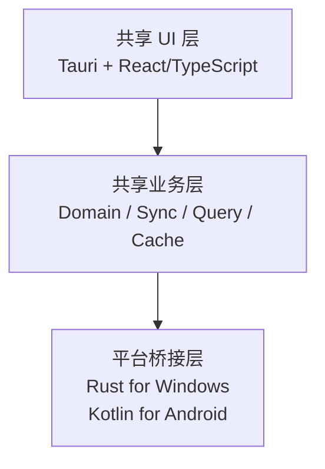
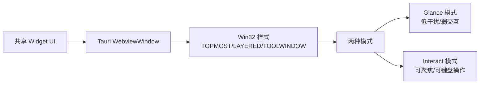
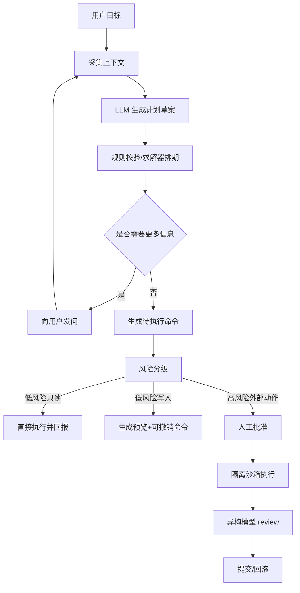

# Agent辅助Todo与日程规划软件方案研究

## 执行摘要

本项目如果以“滴答清单（TickTick）为蓝本”并同时补上“服务器端 Agent、自动任务拆分与排期、多人日程规划记录、外部模型安全执行与 review”的能力，**产品上是可行的，工程上不应追求 100% 纯一套前端代码**。更现实的做法是：**主应用采用 Tauri 2 在 Windows 与 Android 共享主要界面与业务逻辑；Windows 的常驻半透明窗口与 Android 的桌面小组件/可选悬浮窗分别通过原生桥接补齐**。这样既能利用 Tauri 2 官方对 Windows/Android 的跨平台支持与较小体积，也能接受 Android App Widget、`TYPE_APPLICATION_OVERLAY`、Windows Win32 窗口样式这些天然平台差异。citeturn7search1turn7search5turn6search5turn9view0turn9view1turn45view2turn45view3

从产品定位看，TickTick 现有核心能力已经覆盖任务、日历、看板、时间线、艾森豪威尔矩阵、番茄专注、习惯、桌面 Sticky Notes、共享列表、评论/指派，以及最近新增的 MCP/AI 能力。因此新产品的差异化不应只是“有 AI”，而应是：**服务器端长期运行的 Agent、规则化审计与回滚、多人排期冲突求解、外部模型安全执行、以及强人机确认闭环**。citeturn38search7turn38search0turn38search1turn38search2turn38search10turn39search0turn40search3turn41search14turn41search3turn39search8

在架构上，最稳妥的方案是：**客户端本地优先 + 服务器权威同步 + Agent 只负责“建议、拆解、优化、执行提案”，不直接成为唯一事实来源**。具体来说，客户端使用本地 SQLite（WAL）保障离线与快速响应，服务器使用 PostgreSQL 作为权威事务库与审计源，实时同步通过 WebSocket/增量流完成；并发高的富文本/评论类字段可用 CRDT/操作日志，日程冲突和资源约束则交给确定性求解器而不是纯 LLM。citeturn16search2turn16search1turn16search12turn29search0turn29search2turn33search0turn33search6

如果要把“Claude、Codex 等外部模型自动执行代码/任务并 review”做成正式能力，建议采用**三道闸门**：其一，模型路由只给最小必要上下文；其二，执行发生在你自有的隔离沙箱中，而不是默认依赖外部平台的托管执行环境；其三，所有写操作进入“待确认”状态机并可回滚。这样做的原因很直接：OpenAI 与 Anthropic 都支持工具调用、MCP 与代理式循环，但数据保留、ZDR 资格与安全边界并不完全一致，尤其 Anthropic 明确列出 MCP 连接器、代码执行、Files API 等并不属于 ZDR 范围；Claude 计算机使用官方文档也明确提醒了提示注入风险。citeturn12search14turn36search0turn15search0turn36search3turn42search3turn15search5turn12search1turn12search12

## 产品范围与功能对比

下表把“TickTick 核心能力”与“本项目建议扩展能力”放在同一张基线图里。右侧的扩展项是我建议优先纳入范围的功能，而未指定的细节应做成系统策略或租户级配置，而不是硬编码。  

| 维度 | TickTick 蓝本 | 本项目建议扩展 |
|---|---|---|
| 任务层级 | 支持 Folder / List / Section / Task / Subtask 五层管理。 | 保留五层结构；新增 **任务 DAG 依赖**、估时区间、上下文标签、精力预算、工作地点/设备约束。 |
| 任务视图 | List、Kanban、Timeline、Calendar、Eisenhower Matrix。 | 在现有视图之上增加 **“Agent 计划视图”**、**“排期解释视图”**、**“多人容量热力图”**。 |
| 日历能力 | 支持日历视图、拖拽安排任务、Google Calendar 集成与第三方订阅。 | 扩展为 **任务-日程双对象模型**、多人可用性、会议/专注块/缓冲块自动生成、排期冲突求解。 |
| 专注与习惯 | 番茄/Stopwatch、习惯追踪、专注记录同步。 | 增加 **由 Agent 生成专注时段建议**、疲劳/上下文切换惩罚、习惯与任务联动。 |
| 协作 | 共享列表、指派、评论、任务活动。 | 扩展为 **共享日历计划**、审批流、计划版本对比、计划冲突记录、回滚。 |
| 快速采集 | 快速添加、Smart Recognition、语音/AI 添加与自动拆分（近期已出现）。 | 扩展为 **多轮澄清式采集**、邮件/IM/会议纪要解析、Agent 自动补全缺失字段。 |
| AI/MCP | 已支持 TickTick MCP，可在 ChatGPT/Claude 中读写任务。 | 升级为 **服务器 Agent 编排层**：报告生成、任务拆解、自动排期、外部模型执行、review、审批。 |
| 桌面小组件 | Windows 桌面 Sticky Notes、Windows/移动 Widgets、专注 Mini Window。 | Windows 做成 **常驻半透明浮窗**；Android 默认做 **Home Screen App Widget**，可选企业版悬浮窗。 |
| 可访问性 | 官方未公开完整规范，但其多平台 UI 已覆盖桌面/移动核心交互。 | 明确要求 **键盘可达、读屏语义、焦点可见、非颜色区分、可缩放、低干扰模式**。 |
| 交互安全 | 支持共享通知与活动记录。 | 新增 **Agent 建议-确认-执行-回滚** 全链路提示，所有高风险动作必须可撤销。 |

上表中的 TickTick 基线来自其官方帮助中心：Beginner’s Guide、任务层级、Kanban、Timeline、Eisenhower Matrix、Habit、Widgets、Desktop Sticky Notes、Collaboration、Google Calendar、Task Activities、MCP/AI 更新等页面。citeturn38search7turn40search7turn38search0turn38search2turn38search1turn38search10turn39search1turn39search0turn40search3turn41search2turn41search14turn41search3turn39search8

在交互与可访问性上，建议把“浮窗模式”和“交互模式”分开设计。Windows 文档明确指出，`WS_EX_NOACTIVATE` 创建的顶级窗口**不应**通过键盘导航或 Narrator 等辅助技术被激活，因此它适合做“纯瞥视”模式，不适合做默认交互模式；默认交互窗口应保持可聚焦、可被屏幕阅读器访问。Android 与通用 Web/应用可访问性层面，则应对齐 Android Accessibility 与 WCAG 2.2 的基本要求。citeturn28search0turn3search0turn3search1turn3search2

## 技术选型与推荐

### 结论

**推荐路线：Tauri 2 + React/TypeScript 前端 + Rust 原生桥接 + Android Kotlin widget/overlay 模块。**  
原因不是“完全一份代码到处跑”，而是它在当前约束下实现了最好的平衡：  
一是 Tauri 2 官方已经把 Windows 与 Android 纳入同一产品面；  
二是体积与安全边界优于 Electron；  
三是窗口级能力（`transparent`、`alwaysOnTop`、多窗口）已经具备；  
四是 Android 原生 widget 与 Windows 深度窗口控制本来就必须做平台桥接，Tauri 并不会比其他跨端方案更吃亏。citeturn7search1turn7search5turn9view0turn9view1turn9view2turn7search4turn6search5turn8view2

但也必须直说：**Tauri 在这个项目里是“高共享主应用 + 原生平台补丁”的方案，不是“零原生代码”方案**。Android App Widget 需要原生 Android 能力；`TYPE_APPLICATION_OVERLAY` 也属于原生窗口管理；Windows 若要做精细的全局半透明/层叠/工具窗行为，也要调用 Win32 扩展样式或包装原生 API。citeturn26search2turn27search0turn45view2turn45view3turn28search0

### 主要备选方案对比

| 方案 | Windows | Android | 对本项目的适配性 | 关键限制 | 结论 |
|---|---|---|---|---|---|
| **Tauri 2** | 官方支持 | 官方支持 | 共享主应用 UI/逻辑、体积小、权限模型清晰；适合 Windows 浮窗主应用。 | Android widget/overlay 与部分窗口细节仍需原生 Kotlin / Win32 桥接。 | **推荐** |
| **Kotlin Multiplatform + Compose Multiplatform** | 官方支持桌面；Compose 对 Android/桌面稳定 | 官方支持 | Kotlin 一种语言覆盖 Android 原生能力更顺手；透明窗口与 alwaysOnTop 也可做。 | 服务端/AI SDK 生态通常不如 TS/Python 灵活；Web 团队复用较弱。 | **强备选** |
| **Flutter** | 官方支持桌面 | 官方支持 | 跨平台产品迭代快，UI 一致性强。 | Windows 常驻半透明浮窗与 Android widget 往往依赖插件/平台通道；本项目的“平台深度能力”比例较高。 | **可行但次优** |
| **React Native + React Native Windows** | Android 官方，Windows 依赖 React Native Windows | Android 官方 | 如果团队强 JS/React，可复用思维模型。 | Windows 是社区/微软扩展平台，不是 RN 主线平台；桌面深度能力与多端一致性治理成本较高。 | **不优先** |
| **Electron** | 官方仅桌面 | **无 Android 官方目标** | Windows 桌面浮窗开发成熟。 | Android 需要另起一套移动端，直接违背本项目“Windows + Android 主体共建”的目标。 | **不推荐** |

上述比较的“平台支持”与关键限制，基于 Tauri 2 官方平台说明、Electron 官方桌面定位、Flutter 官方多平台说明、React Native 官方对社区扩展平台的表述、React Native Windows 官方文档、以及 Kotlin Multiplatform/Compose Multiplatform 对 Android/desktop 的稳定性说明。citeturn7search1turn11search0turn11search1turn11search13turn11search3turn5search6turn11search14turn30search0turn32search4

### 推荐实施形态

面向落地，我建议把客户端拆成三层：



其中共享层负责任务、日程、同步状态、Agent 建议展示与审批；平台桥接层只处理窗口、系统快捷键、通知、桌面小组件、前台服务、特殊权限。这样能把“必须原生”的面积控制到最小。该判断来自 Tauri 官方的跨平台与移动插件机制，以及 Android/Windows 平台能力的天然差异。citeturn7search1turn6search5turn8view2turn45view3turn28search0

下面这个 Tauri 窗口配置片段可作为 Windows 浮窗原型的最小起点：

```json
{
  "app": {
    "windows": [
      {
        "label": "widget",
        "create": false,
        "decorations": false,
        "transparent": true,
        "alwaysOnTop": true,
        "skipTaskbar": true,
        "resizable": false,
        "width": 360,
        "height": 560,
        "visible": false
      }
    ]
  }
}
```

Tauri 的 `transparent`、`alwaysOnTop`、`decorations`、多窗口与 JS API 都是官方支持能力；但在 Windows 上，`backgroundColor` 的 alpha 会被忽略，因此如果你想做“整个窗口级别的精细透明度”，应再加一个 Win32 原生桥接层，而不是只依赖 WebView 背景色。citeturn9view0turn9view1turn9view2

## 桌面小组件与常驻半透明窗口实现

### Windows 方案

Windows 端建议把“小组件”实现为**独立顶层窗口**，而不是主窗口内的一个面板。核心目标是支持：始终置顶、可拖拽、半透明、可折叠、可切换“纯瞥视/可交互”两种状态。Win32 扩展样式中，`WS_EX_TOPMOST` 适合始终置顶，`WS_EX_LAYERED` 用于分层/透明窗口，`WS_EX_TOOLWINDOW` 可避免出现在 Alt+Tab 中；但 `WS_EX_NOACTIVATE` 不应作为默认方案，因为它会让窗口无法正常被辅助技术键盘导航激活。citeturn28search0

在视觉材质上，不建议把“长期常驻的小组件背景”直接做成重度 Acrylic。Microsoft 明确把 **Mica** 描述为更适合长生命周期窗口、且为性能而设计；**Acrylic** 更偏向临时、轻量、可消隐的表面。Tauri/tauri window effect 文档也提示了 Windows 上 Acrylic 在调整大小/拖动时存在性能问题。因此常驻半透明小组件更适合“透明窗口 + 低成本阴影/毛玻璃局部效果”，而非整窗 Acrylic。citeturn28search2turn10search4



性能上，Windows 浮窗最重要的不是“极致华丽”，而是**低重绘频率**。建议默认只在以下时机刷新：本地数据变更、同步回包、用户交互、整点/半点重新计算日程摘要；不要做高频动画。静态信息窗口的 CPU/GPU 成本远低于持续动画与重毛玻璃。这个判断与 Windows 系统背景、Tauri 窗口效果文档给出的性能提示一致。citeturn28search2turn10search4

### Android 方案

Android 端建议区分两条路径：  
**默认产品路径：Home Screen App Widget。** 这是 Android 官方“at-a-glance”入口，适合显示今日任务、下一个时段、专注块、协作待确认项。Google 官方目前推荐用 Jetpack Glance 以 Compose 风格构建 Widget；同时也保留 RemoteViews/RemoteViewsService 以支持集合类 Widget。citeturn46view3turn27search0turn27search2turn27search5

**可选高级路径：悬浮窗 Overlay。** Android 提供 `TYPE_APPLICATION_OVERLAY`，其窗口能显示在普通 Activity 之上，但在状态栏/输入法之下，并且需要 `SYSTEM_ALERT_WINDOW` 权限；系统还可能为减少视觉干扰而随时调整其位置、大小或可见性。因此它更适合作为企业部署版、重度用户实验功能，**不建议作为面向大众分发的默认主方案**。citeturn45view2turn45view3turn44search0turn44search1

从功耗角度，Android Widget 刷新要非常克制。Android 官方明确指出 Widget 更新在计算上可能很昂贵，应优化更新类型、频率与时机；全量更新成本最高，能局部更新就不要全量更新。同时，WorkManager 会把持久任务保存在内部 SQLite 中，并遵循 Doze 等省电机制，适合做“小组件所需数据的预计算与定时同步”。citeturn46view0turn26search0

一个最小可行的 Android Glance Widget 原型可以类似这样：

```kotlin
class TodayAgendaWidget : GlanceAppWidget() {
    @Composable
    override fun Content() {
        val state = currentState<TodayAgendaState>()
        Column(modifier = GlanceModifier.fillMaxSize().padding(12.dp)) {
            Text("今天")
            state.items.take(4).forEach { item ->
                Text("• ${item.title}")
            }
        }
    }
}
```

这类 Widget 应尽量只显示“下一步最重要的几项信息”，而不是把完整任务系统塞进桌面。复杂编辑应始终跳回主应用。Glance 与 App Widget 的设计初衷都是“at-a-glance”，不是“完整前台应用替身”。citeturn27search0turn46view3

## Agent架构与外部模型执行

### 总体设计

Agent 必须部署在服务器端，建议把它拆成**编排层**而非单体“大脑”：  
API Gateway 负责客户端请求与审批回调；  
Planner 负责拆解任务和生成计划草案；  
Scheduler 负责约束求解；  
Model Router 负责模型选择；  
Executor 负责工具/外部模型调用；  
Reviewer 负责交叉审查；  
Audit & Rollback 记录所有命令与逆操作。  

这样设计的关键原因是：OpenAI Responses API 与 Anthropic Tool Use 都已支持函数调用、MCP/远程工具与代理循环，但“计划生成”和“真实执行”仍然应该被清晰隔离。Anthropic 的 Tool Runner 甚至直接建议：当需要 human-in-the-loop 审批、自定义日志或条件执行时，使用手动循环而不是全自动循环。citeturn12search0turn12search14turn36search0turn15search0turn36search3

### 任务拆解与自动排期

我建议将“LLM 拆解”和“排期求解”分开：  
LLM 只输出结构化中间结果，例如目标、子任务、预估时长、依赖、风险、需要澄清的问题；  
真正的时间安排由确定性求解器完成。Google OR-Tools 的 CP-SAT 官方明确将 Employee Scheduling、Job Shop 等排程问题列为适合的约束求解场景，这与“工作时段、依赖、不重叠、多人容量、上下文切换成本”等排期条件天然匹配。citeturn33search0turn33search1turn33search6

推荐的排期目标函数可以这样设计：

- 硬约束：工作时间、睡眠/不可用时间、会议不可冲突、依赖先后、截止时间、多人共享资源冲突。
- 软约束：尽量减少上下文切换、尽量把深度工作放到高精力时段、尽量连续安排同上下文任务、尽量提前高风险任务。
- Agent 输出：若硬约束无法满足，则产出“不可行原因 + 最少冲突集 + 备选方案”，而不是偷偷改规则。该做法与 CP-SAT 对可行/不可行/最优状态的标准输出方式一致。citeturn33search2turn33search5

### 多模型调用策略

外部模型建议采用**分层路由**：

- **廉价模型**：意图分类、字段归一化、去重、初级摘要。
- **中等模型**：任务拆解、排期解释、周报/日报生成。
- **高价模型**：复杂规划、跨文档综合、代码审查、失败复盘。
- **异构 reviewer**：尽量与主执行模型不同供应商或不同模型族，降低同源错误。  

OpenAI 官方 Responses 工具链已经支持函数调用、内置工具与远程 MCP；Anthropic 官方支持 Tool Use、Remote MCP、Tool Runner，并提供提示缓存以降低成本。因此“多模型+多工具”的工程可行性已经成熟。citeturn12search14turn36search0turn36search8turn15search0turn36search2turn15search1

### 执行、review、确认与回滚

外部模型执行代码/任务的建议流程如下：



“隔离沙箱执行”建议放在你自有基础设施里。原因有三点：  
第一，OpenAI Codex 明确把任务运行在云沙箱中，这对通用编码代理很方便，但对高敏感业务未必是首选；  
第二，Anthropic 数据保留文档明确说明，代码执行、Files API、MCP 连接器并不属于 ZDR 范围；  
第三，Claude 的计算机使用工具官方文档专门警告了提示注入风险。对含个人信息、企业数据、源代码的任务，默认应使用**你自己的容器/微虚拟机沙箱**，并采用 seccomp、NetworkPolicy、gVisor/Firecracker 一类隔离。citeturn12search1turn12search12turn42search3turn15search5turn34search0turn34search1turn34search2turn34search3

## 同步架构与数据模型

### 同步架构

推荐采用**本地优先、服务器权威、操作日志增量同步**。本地优先的好处是：Windows 浮窗和 Android Widget 都极度依赖低延迟局部数据读取；而 SQLite WAL 非常适合高频本地读写。服务器权威的好处是：多人协作、权限控制、审计追踪、回滚与统计都更容易做。citeturn16search2turn16search10turn16search1

在服务端，PostgreSQL 适合作为主事务数据库，因为它自带行级安全（RLS），并且逻辑复制本身就是发布/订阅模型，适合做变化流和只读副本。Redis 可以承担在线状态、短时队列与推送扇出；对象存储承担附件与审计归档。对于多人实时编辑，评论/长备注可使用 CRDT 或操作日志模式，而日程对象更适合“语义冲突 + 规则求解”而不是简单 LWW。citeturn16search1turn16search0turn16search12turn16search3turn29search0turn29search2

### 冲突策略与数据模型

| 实体 | 关键字段 | 建议冲突策略 |
|---|---|---|
| User | id, timezone, locale, working_hours, energy_profile | 服务器权威，低频配置型字段。 |
| Workspace | id, name, owner_id, policy_json | 服务器权威，变更需审计。 |
| Membership | user_id, workspace_id, role | SQL 事务 + RLS。 |
| Task | id, list_id, title, notes, priority, tags, estimate_min, due_at, status | 字段级合并；标题/状态走逻辑时钟，备注建议操作日志或 CRDT。 |
| TaskDependency | from_task_id, to_task_id, type | 服务器权威，禁止环依赖。 |
| ScheduleSlot | id, owner_id, task_id, start_at, end_at, source(agent/manual), confidence | 冲突时不做自动 LWW，改为“冲突对象 + 求解器再排”。 |
| CollaborationEvent | id, actor_id, object_type, diff, created_at | 追加写；不可原地改。 |
| AgentRun | id, intent, input_ref, model_route, result, risk_level, status | 追加写；全量审计。 |
| CommandLog | id, command_json, inverse_command_json, approved_by, committed_at | 追加写；作为回滚基础。 |

一个适合 MVP 的 PostgreSQL 草案如下：

```sql
create table tasks (
  id uuid primary key,
  workspace_id uuid not null,
  title text not null,
  notes text,
  status text not null,
  priority smallint not null default 0,
  estimate_min int,
  due_at timestamptz,
  version bigint not null default 0,
  updated_by uuid not null,
  updated_at timestamptz not null default now()
);

create table schedule_slots (
  id uuid primary key,
  workspace_id uuid not null,
  owner_id uuid not null,
  task_id uuid,
  source text not null,          -- manual | agent | imported
  confidence numeric(4,3),
  start_at timestamptz not null,
  end_at timestamptz not null,
  status text not null default 'planned'
);

create table command_logs (
  id uuid primary key,
  workspace_id uuid not null,
  actor_type text not null,      -- user | agent
  actor_id uuid,
  command_json jsonb not null,
  inverse_command_json jsonb,
  approved_by uuid,
  committed_at timestamptz,
  rolled_back_at timestamptz
);
```

上面的 schema 与推荐，并不是来自某个现成产品，而是根据 PostgreSQL 的 RLS/逻辑复制能力、SQLite WAL、本地优先/CRDT 文献，以及本项目对协作与回滚的要求综合得出的工程设计。citeturn16search1turn16search0turn16search12turn16search2turn29search0turn29search2

## 安全隐私与合规

认证授权建议采用 **OIDC + 授权码流**，并优先支持 **Passkeys/WebAuthn** 作为强认证方式。OIDC 是 OAuth 2.0 之上的身份层标准，WebAuthn 则是 W3C 的公钥凭证 API。对于本项目这种需要跨端同步、共享协作与高风险 Agent 写操作的系统，这一组合比“邮箱验证码 + 长期密码”更适合长期演进。citeturn35search1turn35search5turn35search0turn35search2

数据安全上，传输层至少应满足 TLS 1.2/1.3 要求；静态数据建议采用 AES-256 等成熟算法并把密钥管理独立出来。NIST 对 TLS 与密钥管理都有明确指南，OWASP ASVS 可作为开发与验收的安全基线。citeturn21search0turn21search1turn21search14turn21search2

模型调用隐私方面，要区分供应商差异。OpenAI 官方说明 API 数据默认不用于训练，并提供数据控制、保留控制与区域处理能力；同时企业/API 文档说明某些场景下 API 输入输出可能被安全保留一段时间。Anthropic 官方则明确提供 ZDR，但并非所有功能都符合 ZDR：其文档明确列出了代码执行、Files API、MCP 连接器等不属于 ZDR 的能力。因此，**敏感数据默认不进入 provider-managed code execution / MCP connector / files pipeline**，而应先做脱敏、最小化与本地/自有沙箱执行。citeturn43search0turn43search7turn43search14turn43search17turn42search3

中国合规方面，至少应对齐《个人信息保护法》《数据安全法》以及 **2026 年 1 月 1 日起施行的新修订《网络安全法》**。如果需要把个人信息发送到境外模型 API，还要关注个人信息出境标准合同与 2024 年《促进和规范数据跨境流动规定》：后者对某些不含个人信息/重要数据或低规模个人信息出境情形提供了豁免，但并不免除告知、同意、影响评估等义务。面向国际用户时，还要兼顾 GDPR 的合法性、最小化、透明度和数据主体权利。citeturn17search0turn17search1turn20search0turn20search1turn18search0turn18search1turn17search2

因此，建议本项目落地三条策略：  
其一，**默认最小化**：只把任务标题/时间/标签这些最小必要字段发送到模型，附件、评论、代码仓库内容按需按策略单独授权；  
其二，**风险分层**：个人敏感信息、商业秘密、代码仓库绝不自动发给“不可 ZDR”的能力；  
其三，**数据驻留开关**：企业版允许按租户配置模型提供商、区域处理与外部调用白名单。citeturn42search3turn43search9turn36search0turn36search2

## 部署运维与实施里程碑

### 部署与运维建议

MVP 阶段可以用 **单区容器化部署**：API/Gateway、Sync Service、Agent Orchestrator、Scheduler Worker、Notification Worker、PostgreSQL、Redis、对象存储即可。进入多人协作与外部模型执行阶段后，应把“代码执行/外部动作”拆到独立执行池中，用 Kubernetes Jobs 启动短生命周期任务，用 HPA 做弹性扩缩，并用 NetworkPolicy 限制执行池出网范围。可观测性建议统一到 OpenTelemetry，告警链路用 Prometheus + Alertmanager。citeturn24search3turn24search0turn34search3turn24search5turn24search2

备份策略建议采用三层：  
主库用 PostgreSQL 持续归档/PITR；  
周期性逻辑备份用 `pg_dump`；  
客户端本地 SQLite 提供用户可导出的快照或加密备份。PostgreSQL 官方把连续归档视为高可靠场景中的首选方案之一，而 `pg_dump` 更适合一致性导出而非唯一生产备份手段。SQLite 则提供 Online Backup API。citeturn25search0turn25search1turn25search4turn25search2

### 粗略成本估算

基础设施方面，可以把下面这组数字作为“公开价锚点”而不是精确预算：DigitalOcean 基础 Droplet 从 **$4/月** 起，托管 PostgreSQL 从 **$15.15/月** 起；Cloudflare R2 免费额度含 **10 GB 标准存储**，超额部分 **$0.015/GB-月**。因此，一个**不含模型费的演示/原型环境**可以做到月成本几十美元量级；而带冗余实例、监控、备份、独立执行池的**小规模生产环境**，工程估算通常会上升到低三位数美元/月。citeturn22search0turn22search9turn22search2turn22search6

模型成本应单独核算，并通过路由来控制。以官方公开价为例，OpenAI `gpt-5.4-mini` 价格约为 **$0.75/百万输入 token、$4.50/百万输出 token**；Anthropic `Claude Sonnet 4.6` 约为 **$3/百万输入 token、$15/百万输出 token**，且提示缓存能进一步降低重复上下文成本。一个实用策略是：分类/抽取/低风险摘要走较小模型，拆解/复杂排期解释/代码 review 才升级到 Sonnet 或更强模型。这样能把大部分成本压在几十到数百美元/月范围内，而不是按最强模型全量跑。citeturn23search4turn23search2turn23search5turn15search1

### 分阶段开发计划

| 阶段 | 粗略时间 | 主要交付物 | 人力建议 | 关键风险 | 缓解措施 |
|---|---|---|---|---|---|
| 需求冻结与技术预研 | 2–3 周 | PRD、交互原型、Tauri/Android widget PoC、同步协议草案 | PM 1、Tech Lead 1、客户端 1、后端 1 | 误判平台窗口能力 | 先做 Windows 浮窗 + Android Widget/Overlay PoC |
| 核心客户端 MVP | 6–8 周 | 任务/日历/本地缓存/同步、Windows 浮窗、Android 主应用 | 客户端 2、后端 2、设计 1、QA 1 | 共享层与原生桥接边界失控 | 强制平台桥接层独立模块化 |
| 协作与桌面小组件增强 | 6–8 周 | 共享列表、评论、指派、活动记录、Android Widget、审批基础流 | 客户端 2、后端 2、QA 1 | 并发冲突复杂化 | 先做字段级合并，富文本/评论后置 CRDT |
| Agent 初版 | 6–10 周 | 任务拆解、报告生成、自动排期提案、澄清问答、解释链路 | AI/平台 2、后端 2、客户端 1 | 纯 LLM 排期不稳定 | 排期改用 OR-Tools，LLM 只给候选与解释 |
| 外部模型执行与 review | 6–10 周 | 安全沙箱、Claude/Codex/其他 API 路由、review、回滚 | 平台 2、后端 2、SecOps 1 | 数据泄露/越权执行 | 自建沙箱、白名单工具、审批升级、审计全量 |
| 上线与合规加固 | 4–6 周 | 监控、备份、SLA、灰度发布、合规文档、数据出境策略 | 全员配合 | 审核/合规/权限争议 | 默认关闭高风险权限，企业版单独开关 |

这张里程碑表是工程估算，不是外部事实。它建立在前文对平台能力、同步复杂度、Agent 执行边界和安全隔离成本的综合判断之上。相较普通 Todo 工具，真正拉长工期的不是 UI，而是 **同步一致性、多人排期、Agent 审批/回滚、以及外部执行的合规化**。citeturn16search1turn16search12turn33search0turn36search3turn42search3turn34search0turn34search3

在未指定项方面，以下内容仍需在立项时定稿：是否上架 Google Play、是否面向中国大陆正式商用、是否需要企业私有部署、是否允许境外模型处理个人信息、是否支持邮件/IM/代码仓库等外部工作流写回。这些决策会直接改变 Android Overlay 取舍、数据出境策略、以及外部模型执行默认开关。上述部分在当前需求中均为**未指定**。